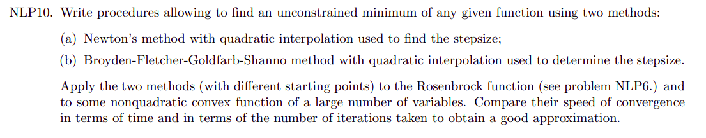
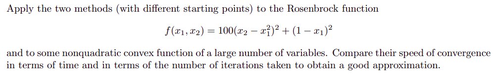

# Non-linear Programming task

In the following task our goal was to implement two gradient methods:
* Newton methods with quadratic interpolation for step size search
* BFGS with quadratic interpolation for step size search 

